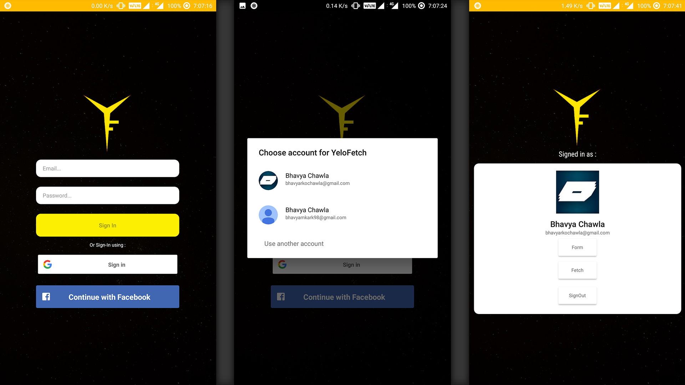

# YeloFetch

YeloFetch is a test android app implementing following features : 

  - Google/Faccebook sign-in authentication using firebase
  - Autodetect and autocomplete adress finder using GPS and Google places API
  - Record audio 
  - Uplaods all data to Realtime Firebase database
  - Fetches all data from Realtime Firebase database

### Screenshots
  
 
 
 
 
 
 
 
 
 

### Documentation

* [Firebase](https://firebase.google.com/)
* [Google Sign-In for Android](https://developers.google.com/identity/sign-in/android/start-integrating)
* [Google Sign-In Firebase Authentication](https://firebase.google.com/docs/auth/android/google-signin?authuser=1)
* [Facebook Sign-In Authentication](https://firebase.google.com/docs/auth/android/facebook-login?authuser=1)
* [Android MediaRecorder](https://developer.android.com/guide/topics/media/mediarecorder)

### Installation

Minimum android API level 21 required
Link for apk : 

